# Stre仕様詳細および導入マニュアル

2021/10/22　アライラク

 

## 利用規約

[https://github.com/AraiRacu/Licence](https://github.com/AraiRacu/Licence) を参照してください。

アライラク(以下「制作者」)の制作した素材(以下「本件素材」)を購入・利用する全てのお客様(以下「利用者」)は、上記URLに記載する利用規約(以下「本規約」)に同意したものといたします。

 

# はじめに

VRChat公式から、Avatar2.0の新規プロジェクト立ち上げが非推奨になりました。それに伴い、Stre-ver1.30より、Avatart2.0の対応を終了し、Avatar3.0へ一本化を行います。

本マニュアルの説明もAvatar3.0向けに対応を行いました。

 

# 目次

- [配布物内容](#配布物内容)
- [アップロードまでの流れ](#アップロードまでの流れ)
- [シェイプキー](#シェイプキー)
  - [プリセット表情](#プリセット表情)
  - [Avatar3\.0でのシェイプキーの入れ替え](#Avatar30でのシェイプキーの入れ替え)
    - [顔の表情の変更](#顔の表情の変更)
  - [LisSyncの干渉防止について](#LisSyncの干渉防止について)
- [ExMenuについて](#ExMenuについて)
- [同梱プレハブ](#同梱プレハブ)
- [同梱3Dオブジェクト](#同梱3Dオブジェクト)
  - [Stre\.fbx](#Strefbx)
  - [Stre_Body\.fbx](#StreBodyfbx)
  - [Stre_Parts\.fbx](#StrePartsfbx)
- [シェーダーおよび改変用のファイル](#シェーダーおよび改変用のファイル)
  - [ArxCharacterShaders](#ArxCharacterShaders)
  - [UTS2\.0](#UTS20)
  - [テクスチャ](#テクスチャ)
- [その他](#その他)

 

# 配布物内容

Stre_ver1_30.zip/

　　┝fbx/

　　│　┝Stre.fbx

　　│　┝Stre_Parts.fbx

　　│　┝Stre_Body.fbx

　　│　└Texture/

　　│　　　┝Bagー(psd ファイルおよびpng 画像5 枚)

　　│　　　┝Bodyー(psd ファイルおよびpng 画像5 枚)

　　│　　　┝Clothー(psd ファイルおよびpng 画像5 枚)

　　│　　　└Hairー(psd ファイルおよびpng 画像2 枚)

　　┝Stre.unitypackage

　　┝readme.txt

　　┝readme_en.txt

　　┝Licence_GitHub

　　└Stre_Manual

 

# アップロードまでの流れ

※Unity2019.4.31fでの方法です。

参考：【最新版】初心者向け：VRChatのアバターアップロード方法 - ASTONESS

　　　[https://astoness.com/blogs/times/how-to-upload-avatar-vrchat](https://astoness.com/blogs/times/how-to-upload-avatar-vrchat)

 

前提条件

- VRChatのアカウント取得
- Unityのアカウント取得
- Unity2019.4.31fのインストール
- 最新版のVRCSDK3-Avatarsの入手
- 本製品のダウンロードおよび解凍
- VRChatトラストシステムによるアバターアップロードの解禁

 

#### 1. Unityを起動し、新規プロジェクトを作成します

   ※Unityアカウントでのログインが必要な場合があります。

   ※Unity Hubを使用している場合、手順が異なります。

   1. Unityを起動し、プロジェクトを作成します。**Project name** に適当なプロジェクト名を入力し、**Template** を**3D** にします。入力後、**Create project** を押します。

      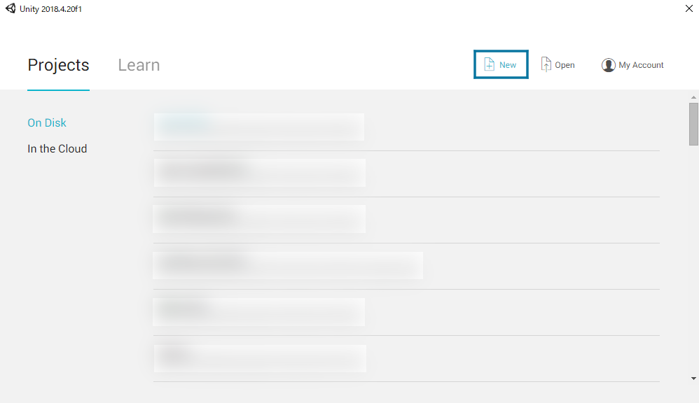

       

      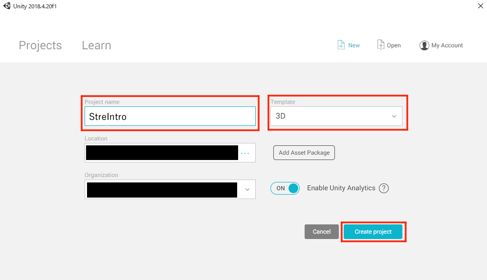

   2. しばらくするとプロジェクトが作成され、Unityの画面が表示されます。

       

#### 2. Unityにパッケージをインポートします

1. **VRCSDK3-Avatars**をインポートします。エクスプローラーからUnityの**Project** タブの**Asset** フォルダにD&Dします。その後、Import画面が開くので、**Import** 押してしばらくするとインポートされます。

   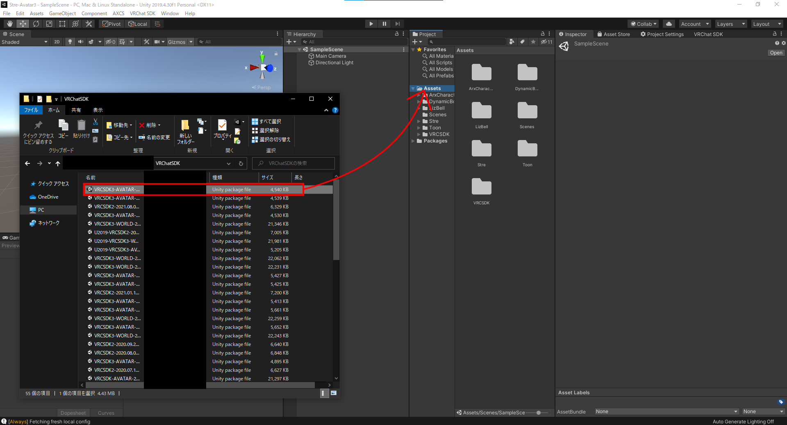

2. **DynamicBone** があれば、ここで、インポートします。**Asset Store** のタブの購入画面などから**Import** を押し、インポートします。

   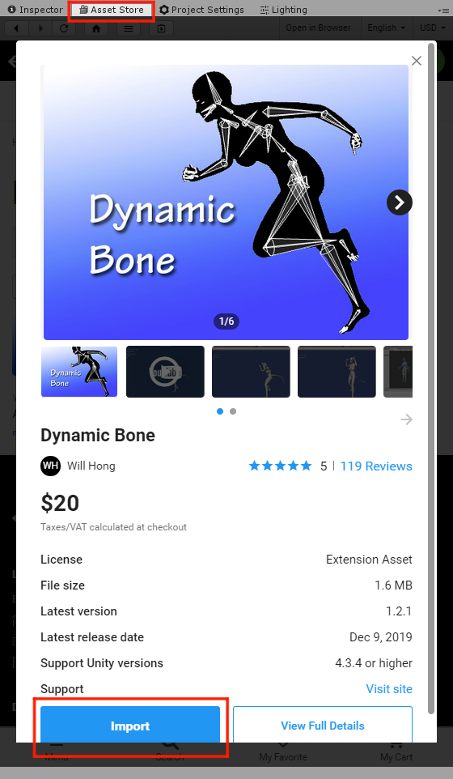

3. 本製品の**Stre.unitypackage**をインポートします。操作は1.のVRCSDKをインポートとしたときと同様です。ユニティちゃんトゥーンシェーダー2.0.8は本パッケージに同梱しているので追加でインポートする必要はありません。

#### 3.VRCSDKにログインします

1. 上のメニューバーの**VRChat SDK** ->**Show Control Panel** でVRChatのコントロールパネルを開き、**Authentication** でログインをします。

   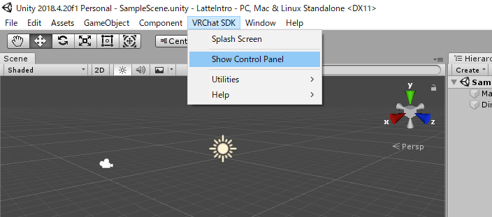

   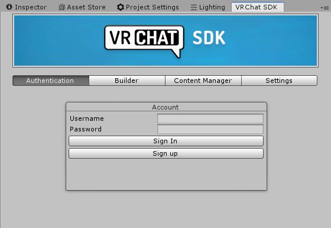

#### 4. Sceneを開きます

1. **Project** タブの**Asset/Stre** から**Stre.unity**をダブルクリックで開いてください。**Hierarchy** にセットアップ済みのアバターのプレハブが用意しています。プレハブの種類については[ここ](#同梱プレハブ) を参照してください。

   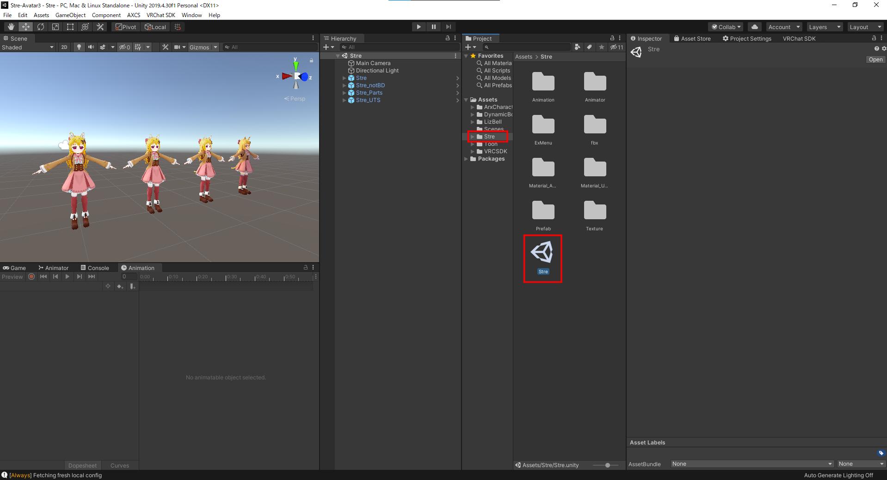

#### 5.アバターをVRChatにアップロードします

1. シーンを保存します。ここで**Ctrl+Shift+ S** で適当なシーン名で保存します。

   ※ここで別途、新規シーンで保存することをおすすめします。(改めてunitypackageをインポートするとStre.untiyが上書きされることがあります。)

2. ログインしたVRChatコントロールパネル内の**Builder** の右下の**Build & Publish** を押します。

   ※Scene内に複数のアバターがある場合は**Builder** でアップロードするアバターを選択してください。

   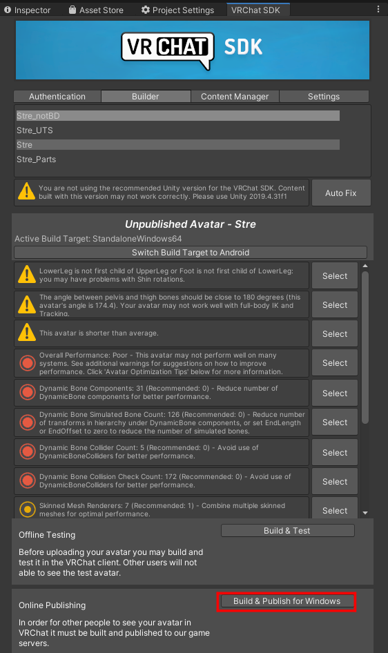

3. しばらくすると**Game** 画面で入力画面が開くので、**Avatar Name** に適当な名前、**Sharing** の**Private** にチェック、**The above infomation~** (同意について)にチェックを入れ、**Upload** を押します。

   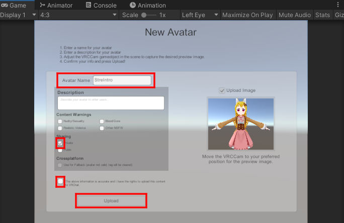

4. 少し待って、画像のような表示が出ればアップロード完了です。

   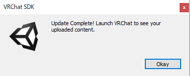

 

# シェイプキー

## プリセット表情

デフォルトでアバターに入っている表情は以下のとおりです。(**Stre/Animation/Anim_FX**内)

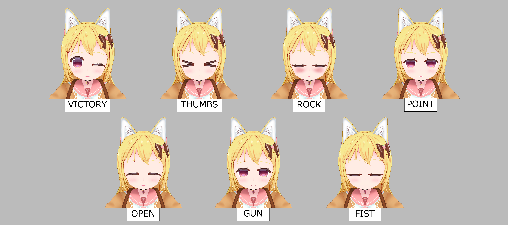

 

追加でセットアップ済みのアニメーションは以下のとおりです。(**Stre/Animation/Sample**内)

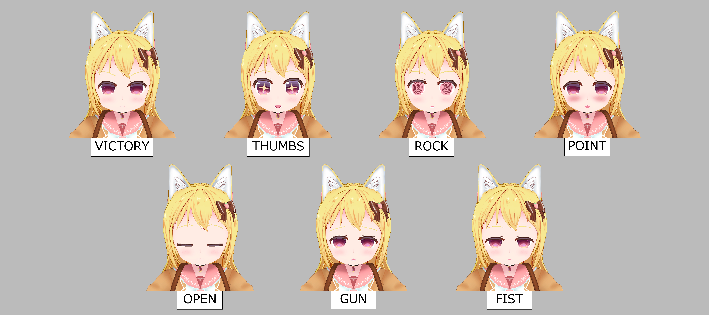

 

## Avatar3.0でのシェイプキーの入れ替え

Avatar3.0で表情を変更する手順を説明します。

 

### 顔の表情の変更

この章では、左右の手に同じ表情を割り当てることを行います。

1.**Animatorウィンドウ**を表示します。

2.**Projectウィンドウ**の**Stre/Animator**の中からAnimatorファイル、**Stre_AvatarV3HandsLayer_FX**を選択し、AnimatorウィンドウにAnimatorの内容を表示します。

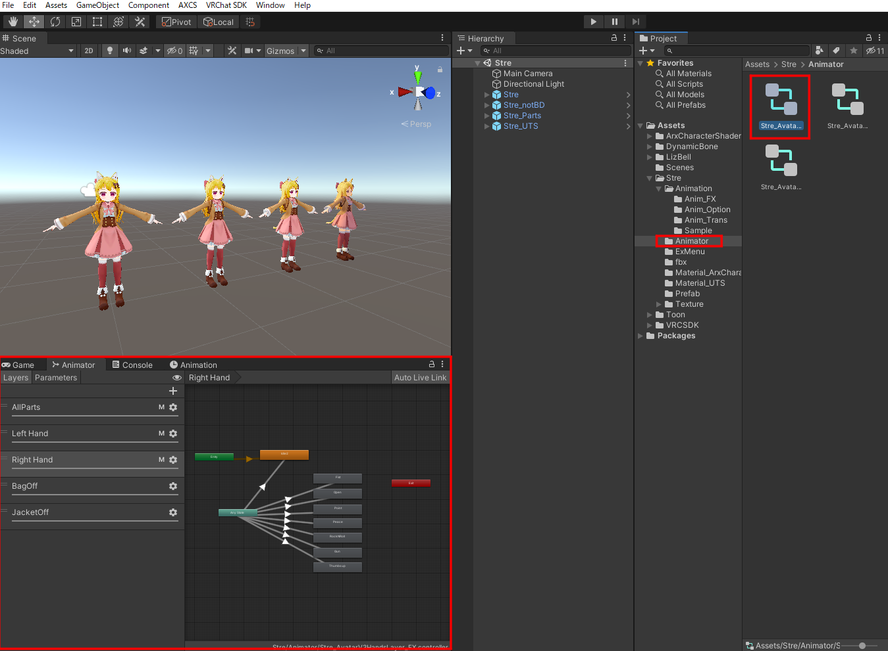

3.AnimatorウィンドウのLayersタブを選択し、その下の**Left Hand**を選択し、左手のハンドジェスチャーのレイヤーを表示してください。

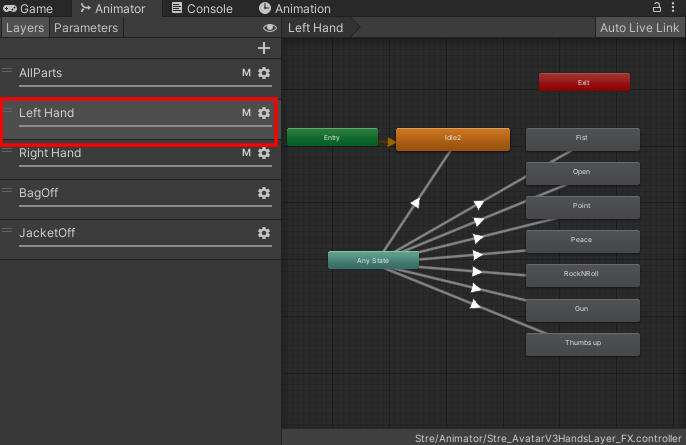

4.**Left Hand**の中にあるFist～ThumbsupのStateの中で、変更したい手の表情を選択します。この状態でInspectorウィンドウに移動するとそのStateの内容が表示されています。

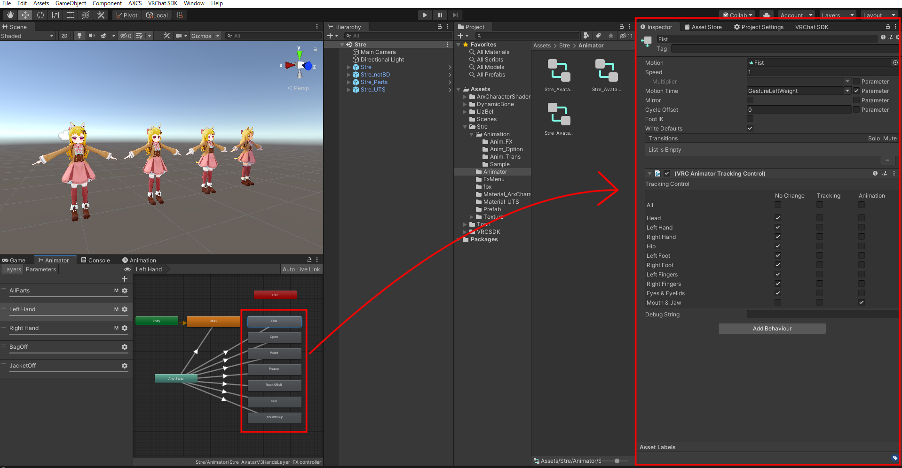

5.Projectウィンドウから**Stre/Animation/Sample**内の変更したいアニメーションをInspector内の**Motion**にアタッチします。

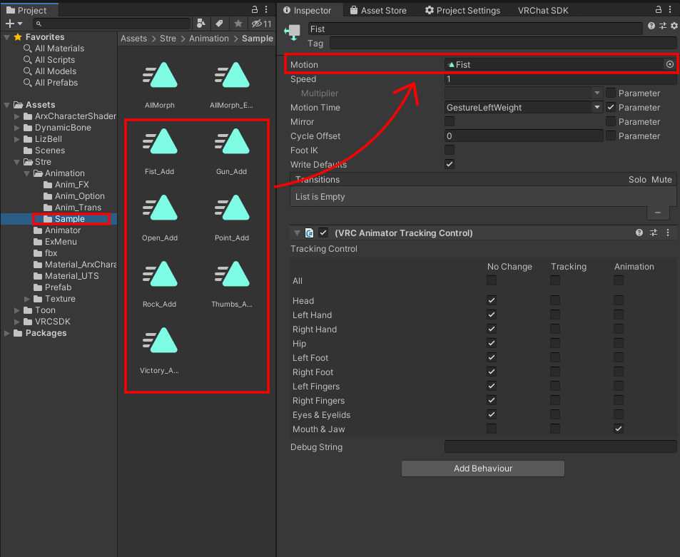

6.次に、右手の設定をします。同じAnimatorでLayersタブに並んている**Right Hand**を選択してください。

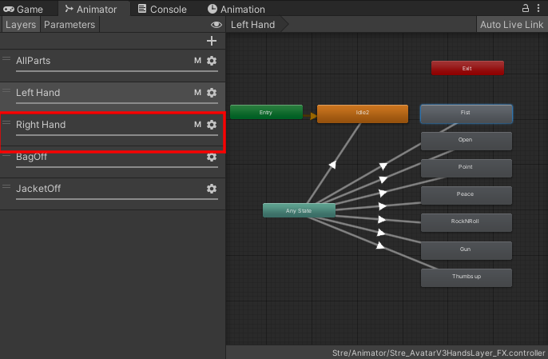

7.Left Handと同様に変更したい手の表情のStateを選択し、Inspector内のMotionに変更するAnimationにアタッチします。

 

## LisSyncの干渉防止について

Avatar3.0の機能で、ハンドジェスチャーで表情を変更しているときにリップシンクを行わない設定ができます。

 

**Projectウィンドウ**の**Stre/Animator**の中からAnimatorファイル、**Stre_AvatarV3HandsLayer_FX**でのRight Hand及びLeft Handの表情がアタッチされているStateに**VRC Animator Tracking Control**が刺してあり、その中の**Mouth&Jaw**の**Animation**のチェックをつけることで干渉を防止しています。

 

参照：[VRChat] Avatars3.0で表情切り替え時のまばたき干渉防止を実装する - がとーしょこらの技術録

[https://gatosyocora.hatenablog.com/entry/2020/08/09/094945](https://gatosyocora.hatenablog.com/entry/2020/08/09/094945)

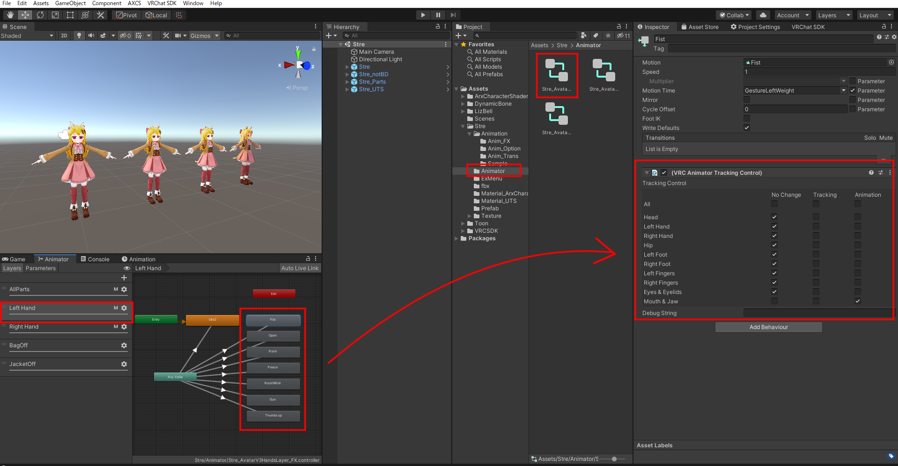

 

# ExMenuについて

本製品ではAvatar3.0の機能を利用して、アバターの鞄、ジャケットの表示非表示をすることができます。

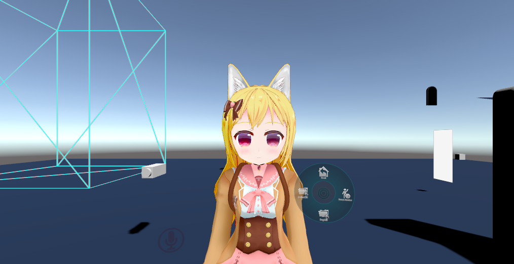

これらのAnimatorの機能はAssetフォルダ内のStre/Animator内、Stre_AvatarV3HandsLayer_FXで設定されています。

それぞれのオブジェクトの表示非表示はそれぞれ1つずつのレイヤーに分けて設定しています。

また、ExMenuはStre/ExMenu内のStreExMenu及びStreExParametersで設定されています。

 

参考：[VRChat] Avatars3.0で物を出し入れする (EmoteSwitchみたいなもの) - がとーしょこらの技術録

[https://gatosyocora.hatenablog.com/entry/2020/08/08/164516](https://gatosyocora.hatenablog.com/entry/2020/08/08/164516)

 

# 同梱プレハブ

本製品には以下のプレハブを用意しています。それ以外については改変をお願いします。

- **Stre** (推奨)
  - デフォルト
- **Stre_Parts** 
  - パーツ分け
- **Stre_notBD**
  - DynamicBoneなし

 

# 同梱3Dオブジェクト

## Stre\.fbx

 

- ポリゴン数：37962
- オブジェクト数：7

 

## Stre_Body.fbx

素体と髪の毛のみのモデルデータです。

 

- ポリゴン数：20992
- オブジェクト数：4

 

## Stre_Parts.fbx

衣装のパーツを分割したモデルデータです。

 

- ポリゴン数：37962
- オブジェクト数：12

 

# シェーダーおよび改変用のファイル

## ArxCharacterShaders

synqark(@synqark) 氏ArxCharacterShaders(build 12) を使用しています。ArxCharacterShadersは本UnityPaclage に同梱しています。ArxCharacterShaders はUnlicenseです。
Arktoon Shaders [https://booth.pm/ja/items/2493539](https://booth.pm/ja/items/2493539)

## UTS2\.0

ユニティ・テクノロジーズ・ジャパン合同会社のユニティちゃんトゥーンシェーダー 2.0 (UTS2.0) Ver.2.0.8 を使用しています。UTS2.0.7.5 は本UnityPackageに同梱しています。 

「ユニティちゃんトゥーンシェーダー 2.0」は、UCL2.0（ユニティちゃんライセンス 2.0）で提供されます。 ユニティちゃんライセンスについては、以下を参照してください。 

UCL2.0 [http://unity-chan.com/contents/guideline/](http://unity-chan.com/contents/guideline/)

 

## テクスチャ

テクスチャのpsd ファイル及びpng の各ファイルを同梱しています。改変等にご利用ください。

 

# その他

その他、疑問やバグなどがあれば以下の連絡先に連絡をお願いします。 

アライラク (Twitter : [@AraiRacu](https://twitter.com/AraiRacu)) 

 

# リリースノート

2019/08/02 初稿

2019/09/20 fbx ファイルについての変更情報の追加
                     マテリアルの変更情報の追加
                     シェーダーの追加情報の追加
                     リンクの構築

2021/10/22 Avatar3.0への移行に際し、マニュアルを全面改訂